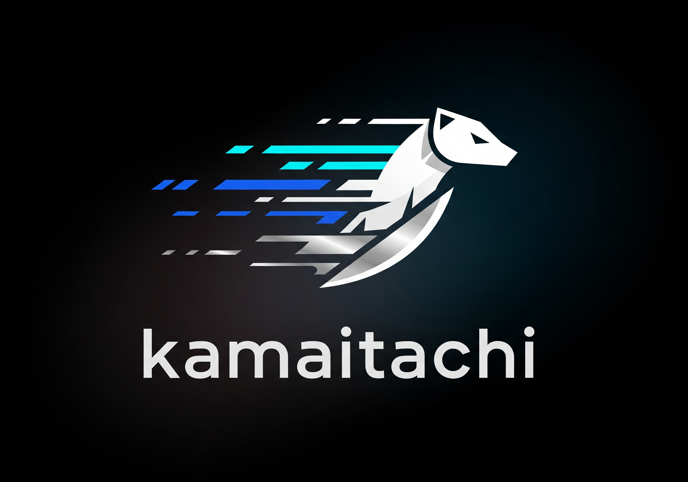

# kamaitachi 鎌鼬



> 風より速く、爪痕一つ残さず動画を切り刻む  
> Rust + GPUIで作られた、最速・最凶のHandBrake代替トランスコーダー

一瞬で4Kを720pに。巨大ファイルを骨まで圧縮する妖怪が、ここに降臨。(ここまでGrok)

## 特徴

- **高速トランスコード**: HWアクセラレーション自動検出（NVENC / QSV / AMF）
- **モダンUI**: GPUI + gpui-componentによる高速でネイティブなUI
- **簡単操作**: ドラッグ＆ドロップでファイル追加、ワンクリックで変換開始
- **柔軟な設定**: コーデック、解像度、品質、プリセットを自由に選択

## 対応形式

### 入力

mp4, mkv, avi, mov, webm, flv, wmv, m4v, ts

### 出力

- **コンテナ**: MP4 / MKV
- **ビデオコーデック**: H.264 / H.265 (HEVC) / VP9 / AV1
- **オーディオコーデック**: AAC / MP3 / FLAC / コピー（無変換）

## HWアクセラレーション

| メーカー | 対応エンコーダ |
|---------|--------------|
| NVIDIA | h264_nvenc, hevc_nvenc, av1_nvenc |
| Intel | h264_qsv, hevc_qsv, av1_qsv, vp9_qsv |
| AMD | h264_amf, hevc_amf, av1_amf |

## ビルド方法

### 前提条件

- **Rust** (rustup でインストール推奨)
- **Visual Studio Build Tools 2022** (Windows の場合必須)
  - 「C++ によるデスクトップ開発」ワークロードをインストール
  - Windows SDK が必要

### Windows でのビルド

Windows では Visual Studio の開発者環境を有効にしてからビルドする必要があります：

```powershell
# PowerShell の場合
cmd /c "`"C:\Program Files (x86)\Microsoft Visual Studio\2022\BuildTools\VC\Auxiliary\Build\vcvars64.bat`" >nul 2>&1 && cargo build --release"

# または、x64 Native Tools Command Prompt for VS 2022 を開いてから
cargo build --release
```

### 開発者コマンドプロンプトを使用する方法

1. スタートメニューから「x64 Native Tools Command Prompt for VS 2022」を起動
2. プロジェクトディレクトリに移動
3. `cargo build --release` を実行

### 実行

```powershell
# リリースビルドの実行ファイル
.\target\release\kamaitachi.exe

# または開発用
cargo run --release
```

### 既存のFFmpegを使用する場合

```powershell
# Chocolatey版FFmpegを使用する例
$env:FFMPEG_DIR = "C:\Users\yuubi\AppData\Local\UniGetUI\Chocolatey"
cargo run --release
```

### トラブルシューティング

#### `ring` クレートのビルドエラー

`vcruntime.h` が見つからないエラーが出る場合、Visual Studio の環境変数が設定されていません。
上記の「Windows でのビルド」セクションの手順に従って、vcvars64.bat を実行してからビルドしてください。

#### リンカーエラー (`link: not found` など)

Git Bash の `/usr/bin/link` が使用されている可能性があります。
上記の Developer Command Prompt を使用するか、PATH の設定を確認してください。

## ライセンス

GPL-3.0

本ソフトウェアはFFmpegのGPLビルドを使用するため、GPLライセンスの下で配布されます。

### 使用ライブラリ

- [GPUI](https://github.com/zed-industries/zed) - Apache-2.0
- [gpui-component](https://github.com/longbridge/gpui-component) - Apache-2.0
- [ez-ffmpeg](https://github.com/YeautyYE/ez-ffmpeg) - MIT/Apache-2.0/MPL-2.0
- [FFmpeg](https://ffmpeg.org/) - GPL v2+

## 開発状況

- [x] Phase 1: 環境構築
- [x] Phase 2: FFmpeg管理
- [x] Phase 3: 基本UI
- [x] Phase 4: 設定パネル
- [x] Phase 5: トランスコードエンジン
- [x] Phase 6: 進捗連携
- [x] Phase 7: 仕上げ

---

Copyright (C) 2025 yuubinnkyoku
